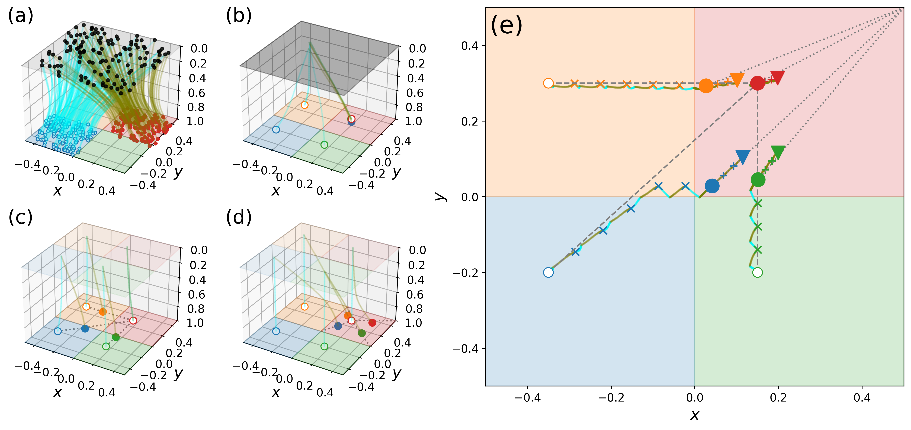
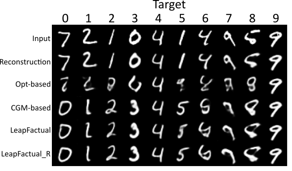
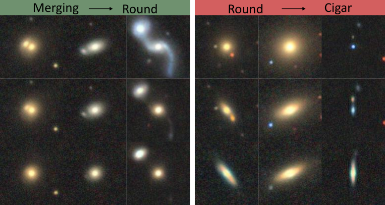
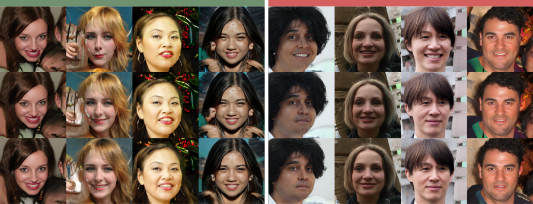

<h1>
<p align="center">
    
</p>
</h1>

This repository is the official implementation of _LeapFactual: Robust Visual Counterfactual Explanation Using Conditional Flow Matching_.

<!--  -->


## Setup / Installation guide
```bash
pip install -r requirements.txt
```

## Experiments
### Toy Experiment - Square
Check the notebook `./Toy_Experiment/Experiment_Square.ipynb`

### Quantitative Assessment - MorphoMNIST
<!--  -->


1. Download the [MorphoMNIST](https://github.com/dccastro/Morpho-MNIST?tab=readme-ov-file#datasets) data and place it in `./Morpho_MNIST/morphoMNIST_data`. We use the same datasets as used in [Morpho-MNIST paper](https://arxiv.org/abs/1809.10780).
2. Check the notebook `./Morpho_MNIST/Experiment_MorphoMNIST.ipynb`


### Model Improvement - Galaxy10
<!--  -->


#### Preparation
1. Download the [Galaxy10 DECaLS](https://astronn.readthedocs.io/en/latest/galaxy10.html) data and place it in `./Galaxy10/galaxy10_data`.
2. Run 
   ```bash
   python Galaxy10/galaxy10_data/convert_split_train_test.py
   ```
   to split training and test datasets and convert hdf5 file to image folder.
3. Run 
   ```bash
   bash Galaxy10/galaxy10_data/split_fraction.sh
   ```
   to generate the 20% training dataset.

#### Train Classifier and VAE
1. Run 
   ```bash
   python training_scripts/train_vaes.py --config training_scripts/configs/galaxy10_vae.yaml
   ``` 
   to train a VAE model
2. Run 
   ```bash
   python training_scripts/train_classifier.py --config training_scripts/configs/galaxy10_vgg_100.yaml
   ``` 
   to train the strong classifier.
3. Run 
   ```bash
   python training_scripts/train_classifier.py --config training_scripts/configs/galaxy10_vgg_20.yaml
   ``` 
   to train the weak classifier.
#### Train Flow Matching Model and Generate Synthetic Data
1. Run 
   ```bash
   python Galaxy10/Galaxy10_train_flow_mlp.py
   ``` 
   to train the flow matching model.
2. Run 
   ```bash 
   python Galaxy10/Galaxy10_generate_data.py
   ``` 
   to generate synthetic data.
#### Train Classifier Using Synthetic Data
1. Run 
   ```bash 
   python training_scripts/train_classifier.py --config training_scripts/configs/galaxy10_vgg_syn_CE.yaml
   ```  
   to train the classifier using the 20% data with the generated CE samples.
2. Run 
   ```bash 
   python training_scripts/train_classifier.py --config training_scripts/configs/galaxy10_vgg_syn_robustCE.yaml
   ``` 
   to train the classifier using the 20% data with the generated robust CE samples.


### Generalization - FFHQ
<!--  -->


1. download the checkpoint `stylegan3-r-ffhq-1024x1024.pkl` from the [StyleGAN3 pretrained models](https://catalog.ngc.nvidia.com/orgs/nvidia/teams/research/models/stylegan3/files) website and place it in `FFHQ/checkpoints`.
2. Check the notebook `FFHQ/Experiment_FFHQ.ipynb`
