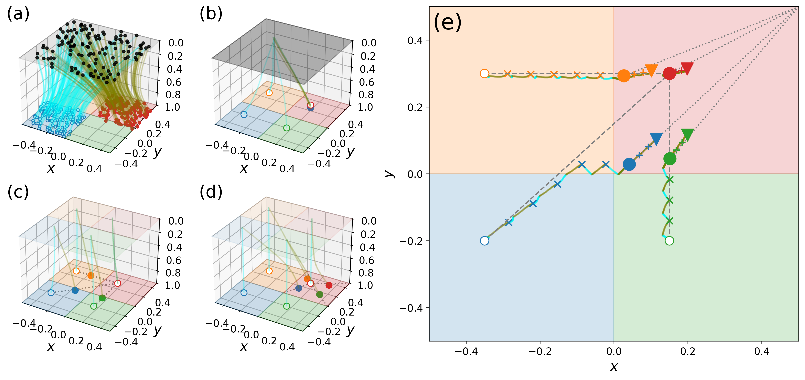
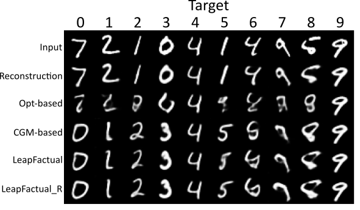
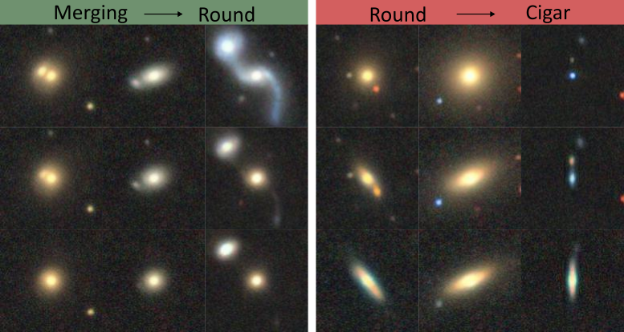
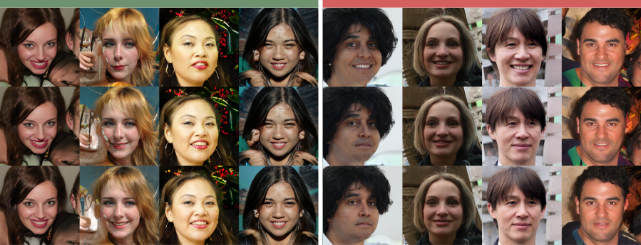

<h1>
<p align="center">
    
</p>
</h1>

<h4 align="center">
    
[](https://arxiv.org/abs/2510.14623)
</h4>

This repository is the official implementation of _LeapFactual: Reliable Visual Counterfactual Explanation Using Conditional Flow Matching_.
_LeapFactual_ is a model-agnostic counterfactual explanation algorithm based on conditional flow matching that generates reliable and informative counterfactuals even under model–truth divergence, extending explainability to human-in-the-loop systems.

<!--  -->


## Table of Contents
- [Installation](#installation)
- [Experiments](#experiments)
    - [Toy Experiment](#toy_square)
    - [MorphoMNIST](#morphomnist)
    - [Galaxy10](#galaxy)
    - [FFHQ](#ffhq)
- [Structure of the repository](#structure)
- [Citation](#citation)

## Installation
```bash
pip install -r requirements.txt
```

## Experiments
### Toy Experiment - Square <a name="toy_square"></a>
Check the notebook `./Toy_Experiment/Experiment_Square.ipynb`

---

### Quantitative Assessment - MorphoMNIST <a name="morphomnist"></a>
<!--  -->


1. Download the [MorphoMNIST](https://github.com/dccastro/Morpho-MNIST?tab=readme-ov-file#datasets) data and place it in `./Morpho_MNIST/morphoMNIST_data`. We use the same datasets as used in [Morpho-MNIST paper](https://arxiv.org/abs/1809.10780).
2. Check the notebook `./Morpho_MNIST/Experiment_MorphoMNIST.ipynb`

---

### Model Improvement - Galaxy10  <a name="galaxy"></a>
<!--  -->


#### Preparation
1. Download the [Galaxy10 DECaLS](https://astronn.readthedocs.io/en/latest/galaxy10.html) data and place it in `./Galaxy10/galaxy10_data`.
2. Run 
   ```bash
   python Galaxy10/galaxy10_data/convert_split_train_test.py
   ```
   to split training and test datasets and convert hdf5 file to image folder.
3. Run 
   ```bash
   bash Galaxy10/galaxy10_data/split_fraction.sh
   ```
   to generate the 20% training dataset.

#### Train Classifier and VAE
1. Run 
   ```bash
   python training_scripts/train_vaes.py --config training_scripts/configs/galaxy10_vae.yaml
   ``` 
   to train a VAE model
2. Run 
   ```bash
   python training_scripts/train_classifier.py --config training_scripts/configs/galaxy10_vgg_100.yaml
   ``` 
   to train the strong classifier.
3. Run 
   ```bash
   python training_scripts/train_classifier.py --config training_scripts/configs/galaxy10_vgg_20.yaml
   ``` 
   to train the weak classifier.
#### Train Flow Matching Model and Generate Synthetic Data
1. Run 
   ```bash
   python Galaxy10/Galaxy10_train_flow_mlp.py
   ``` 
   to train the flow matching model.
2. Run 
   ```bash 
   python Galaxy10/Galaxy10_generate_data.py
   ``` 
   to generate synthetic data.
#### Train Classifier Using Synthetic Data
1. Run 
   ```bash 
   python training_scripts/train_classifier.py --config training_scripts/configs/galaxy10_vgg_syn_CE.yaml
   ```  
   to train the classifier using the 20% data with the generated CE samples.
2. Run 
   ```bash 
   python training_scripts/train_classifier.py --config training_scripts/configs/galaxy10_vgg_syn_robustCE.yaml
   ``` 
   to train the classifier using the 20% data with the generated robust CE samples.

---

### Generalization - FFHQ  <a name="ffhq"></a>
<!--  -->


1. download the checkpoint `stylegan3-r-ffhq-1024x1024.pkl` from the [StyleGAN3 pretrained models](https://catalog.ngc.nvidia.com/orgs/nvidia/teams/research/models/stylegan3/files) website and place it in `FFHQ/checkpoints`.
2. Check the notebook `FFHQ/Experiment_FFHQ.ipynb`

---

## Structure of the repository  <a name="structure"></a>

```bash
.
├── FFHQ                                  # files concerning experiments with FFHQ
│   ├── Experiment_FFHQ.ipynb             # experiment structure
│   ├── FFHQ_quantitative_eval.py         # quantitative evaluation including history plot
│   ├── FFHQ_quantitative_eval_ref.py     # quantitative evaluation 
│   ├── FFHQ_train_flow.py                # train model for this experiment
│   └── exp_utils.py                      # utilities like Human_Annotator
│
├── Galaxy10                              # files concerning experiments with Galaxy10
│   ├── galaxy10_data                     # data preprocessing files
│   ├── Galaxy10_generate_data.py         # generate synthetic data
│   └── Galaxy10_train_flow_mlp.py        # train model for this experiment
│
├── Morpho_MNIST                          # files concerning experiments with MorphoMNIST
│   └── Experiment_MorphoMNIST.ipynb      # experiment setup 
│
├── Toy_Experiment                        # files concerning toy experiments 
│   └── Experiment_Square.ipynb           # experiment setup 
│
├── assets                                # image-files for README  
│   └── ...                 
│
├── external_pkgs                         # links to external git modules 
│   ├── Morpho-MNIST                      
│   └── stylegan3                  
│
├── training_scripts                      # scripts necessary for training
│   ├── configs                           # experiment configs
│   │   └── ... 
│   ├── data                              # scripts for torch-datasets
│   │   └── ...
│   ├── experiments                       # experiment scripts for classifier and GAN experiments
│   │   └── ...
│   ├── models                            # model files 
│   │   ├── VAE 
│   │   │   └── ...
│   │   └── classifiers
│   │       └── ...
│   ├── train_classifier.py               # training scripts for classifier-experiments
│   └── train_vaes.py                     # training scripts for VAE-experiments
│           
│ 
├── .gitignore                            # ignore files that cannot commit to Git
├── .gitmodules                           # Git submodules
├── LICENSE                               # license file  
├── README.md                             # project description   
└── requirements.txt                      # dependencies  
```

## Citation
If you use our method or code from this repository, please cite our paper:
Zhuo Cao, Xuan Zhao*, Lena Krieger*, Hanno Scharr, Ira Assent, (2025, December). LeapFactual: Reliable Visual Counterfactual Explanation Using Conditional Flow Matching. Accepted for publication at the *The Thirty-Ninth Annual Conference on Neural Information Processing Systems,
                    (NeurIPS) 2025*.
```
@unpublished{cao2025leapfactual,
  title        =    {LeapFactual: Reliable Visual Counterfactual Explanation Using Conditional Flow Matching},
  author       =    {Cao, Zhuo and Zhao, Xuan and Krieger, Lena and Scharr, Hanno and Assent, Ira},
  url          =    {https://neurips.cc/virtual/2025/poster/119174},
  year         =    {2025},
  note         =    {Accepted for publication at The Thirty-Ninth Annual Conference on Neural Information Processing Systems,
                    (NeurIPS) 2025}
}
```
## License

### Code
This work is licensed under the [Apache 2.0 License](LICENSE). This license is valid for all code files implemented by us.

### Data
We used the following datasets:
- [FFHQ](https://github.com/NVlabs/ffhq-dataset) is made available under [Creative Commons BY-NC-SA 4.0](https://creativecommons.org/licenses/by-nc-sa/4.0/) by NVIDIA Corporation
- [Galaxy10 DECaLS](https://astronn.readthedocs.io/en/latest/galaxy10.html) published by [Lintott et al., 2008](https://arxiv.org/abs/0804.4483)
- [MorphoMNIST](https://github.com/dccastro/Morpho-MNIST) is licensed under [MIT License](https://github.com/dccastro/Morpho-MNIST/blob/main/LICENSE)

Data that we generated for our toy experiments are licensed under [Creative Commons Zero (CC0) license](https://creativecommons.org/public-domain/cc0/).


